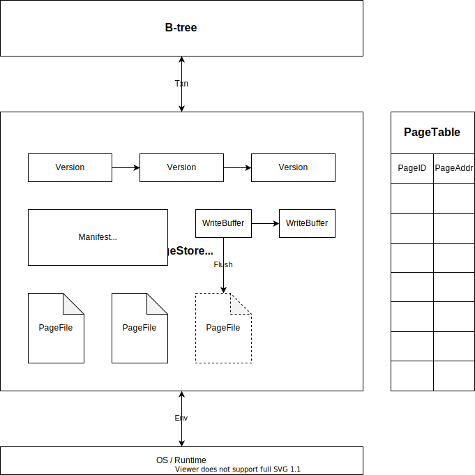

# PhotonDB

[![crates][crates-badge]][crates-url]
[![docs][docs-badge]][docs-url]

[crates-badge]: https://img.shields.io/crates/v/photondb?style=flat-square
[crates-url]: https://crates.io/crates/photondb
[docs-badge]: https://img.shields.io/docsrs/photondb?style=flat-square
[docs-url]: https://docs.rs/photondb/latest/photondb

A high-performance storage engine for modern hardware and platforms.

PhotonDB is designed from scratch to leverage the power of modern multi-core chips, storage devices, operating systems, and programming languages.

Features:

- Latch-free data structures, scale to many cores.
- Log-structured persistent stores, optimized for flash storage.
- Asynchronous APIs and efficient file IO, powered by io_uring on Linux.

## Design



## Progress

We have published the `photondb` crate v0.0.4. You can try some examples to see what it can do so far. It is important to note that the current version is still too young to be used for anything serious.

Use the synchronous APIs:

```toml
[dependencies]
photondb = "0.0.4"
```

```rust
use photondb::{std::Table, Result, TableOptions};

fn main() -> Result<()> {
    let table = Table::open("/tmp/photondb", TableOptions::default())?;
    let key = vec![1];
    let val1 = vec![2];
    let val2 = vec![3];
    // Simple CRUD operations.
    table.put(&key, 1, &val1)?;
    table.delete(&key, 2)?;
    table.put(&key, 3, &val2)?;
    assert_eq!(table.get(&key, 1)?, Some(val1));
    assert_eq!(table.get(&key, 2)?, None);
    assert_eq!(table.get(&key, 3)?, Some(val2.clone()));
    let guard = table.pin();
    // Get the value without copy.
    assert_eq!(guard.get(&key, 3)?, Some(val2.as_slice()));
    // Iterate the tree page by page.
    let mut pages = guard.pages();
    while let Some(page) = pages.next()? {
        for (k, v) in page {
            println!("{:?} {:?}", k, v);
        }
    }
    Ok(())
}
```

Use the asynchronous APIs:

```toml
[dependencies]
photondb = "0.0.4"
photonio = "0.0.5"
```

```rust
use photondb::{Result, Table, TableOptions};

#[photonio::main]
async fn main() -> Result<()> {
    let table = Table::open("/tmp/photondb", TableOptions::default()).await?;
    let key = vec![1];
    let val1 = vec![2];
    let val2 = vec![3];
    // Simple CRUD operations.
    table.put(&key, 1, &val1).await?;
    table.delete(&key, 2).await?;
    table.put(&key, 3, &val2).await?;
    assert_eq!(table.get(&key, 1).await?, Some(val1.clone()));
    assert_eq!(table.get(&key, 2).await?, None);
    assert_eq!(table.get(&key, 3).await?, Some(val2.clone()));
    let guard = table.pin();
    // Get the value without copy.
    assert_eq!(guard.get(&key, 3).await?, Some(val2.as_slice()));
    // Iterate the tree page by page.
    let mut pages = guard.pages();
    while let Some(page) = pages.next().await? {
        for (k, v) in page {
            println!("{:?} {:?}", k, v);
        }
    }
    Ok(())
}
```

Run the example with:

```
cargo +nightly-2022-10-01 run
```
