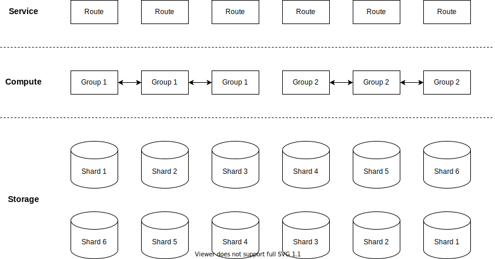
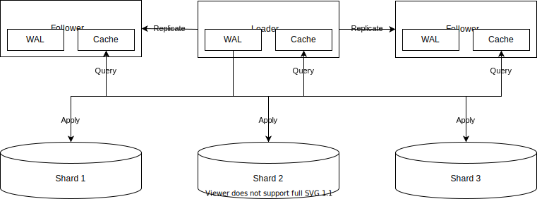

# PhotonDB

This document describes the top-level design of PhotonDB.

## Overview

PhotonDB is a distributed data store.

PhotonDB disaggregates compute and storage to provide a scalable and cost-effective service.

## Architecture

PhotonDB employs a three-tier architecture:

- The service tier consists of a set of route nodes.
- The compute tier consists of a set of group nodes.
- The storage tier consists of a set of shard nodes.

